# Create an Azure mutli-environment Infrastructure with Terraform and Azure DevOps

### Files

|File Name | Description |
|--------- | ------------|
| main.tf | It contains all the resource configurations |
| mainvar.tf | It Contains all the sensitive data (sub ID, client ID, Tenant ID, client secret). Replace this file variables with the pipeline variables for each environment <ul><li>subscriptionid</li><li>tenantid</li><li>clientid</li><li>clientsecret</li><li>environment</li><li>location</li><li>starage account resource group name</li><li>storage account container name</li><li>key (statefile name for each environment)</li> |
| variables.tf | common variables |
| provider.tf | Provider is basically to configure or provisioning resources in different cloud environments |


## Introduction
This document will cover the basic architecture of terraform and it includes the 
* Comparison between ARM template, Terraform 
* Benefits of using terraform
* How to store the state files in remote backend (Azure Blob Storage)  
* How to pass the AD client secrets in pipeline variables instead of storing those secrets in code repository
* How to use the same configuration files for multiple environments

### ARM vs Terraform
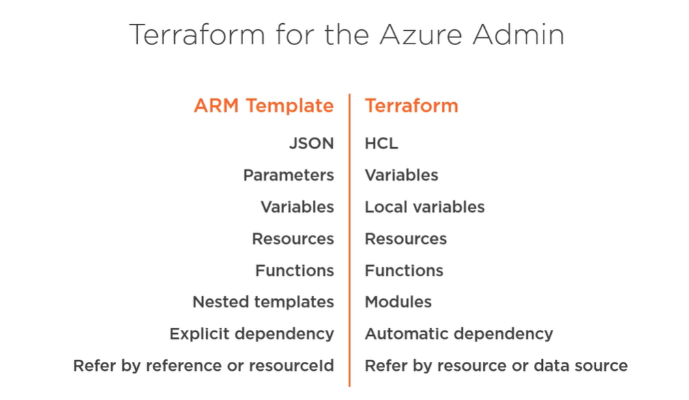

### Resource (ARM vs Terraform)
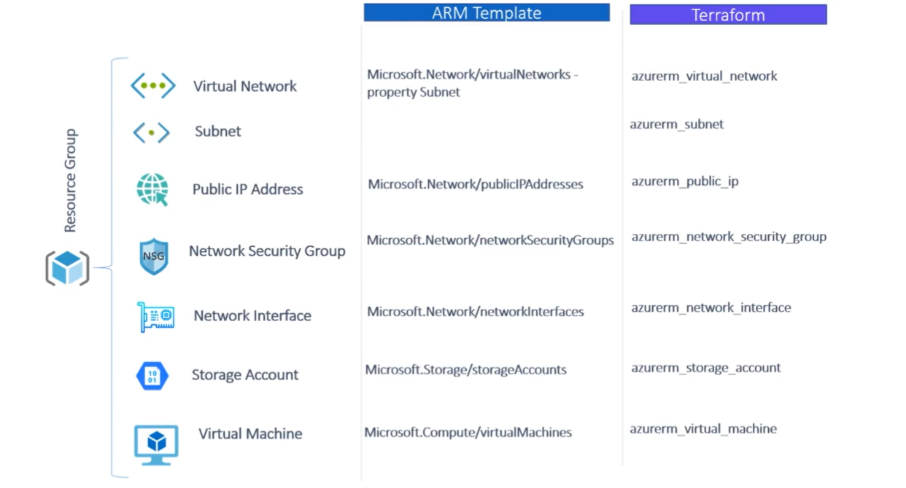

### Resources syntax (ARM vs Terraform)
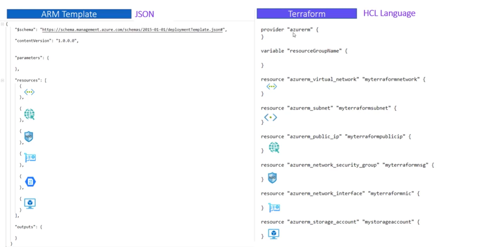

### Benifits of using Terraform for Azure
* Use terraform as you won't have to learn any tools since it is easy to write, and easy to understand. 
* The Terraform enables users to validate and preview infrastructure changes before application. 
* Deploys the same template multiple times to create identical development, test, and production environments.
* Unintended changes can be caught early in the development process


### Terraform Installation
Terraform is an open source flatform and just need to install the terraform package in target server if you want to start working.

**Installation:**
For windows, download the package from https://www.terraform.io/downloads.html and extract the file into any location. Now, set the terraform path in system advanced settings 

Open PC properties :arrow_forward: Advanced system settings :arrow_forward: Environment Variables :arrow_forward: Edit :arrow_forward: Paste the path

### Provider
Terraform provider can be defined within the infrastructure plan but are recommended to be stored in their own provider file. All files in your Terraform directory using the .tf file format will be automatically loaded during operations.


Provider is basically to configure or provisioning resources in different cloud environments. We can use the same configuration of terraform file in  multi-cloud environment by modifying the cloud provider name.

In this below block we are deploying the resources in azure

```
Provider "azurerm" {
	Version= "~>1.13.0"
}
```

The version is optional. It is used to constrain the provider to a specific version or a range of versions in order to prevent downloading a new provider that may possibly contain breaking changes. If the version isn't specified, Terraform will automatically download the most recent provider during initialization.

With in the provider block you can define the azure account login details like below or you can define those details in the variables.tf file

```
provider "azurerm" {
	
	subscription_id = "********"
	tenant_id = "*********"
	client_id = "*********"
	client_secret = "*********"
	features {}
}
```

### Terraform Authentication
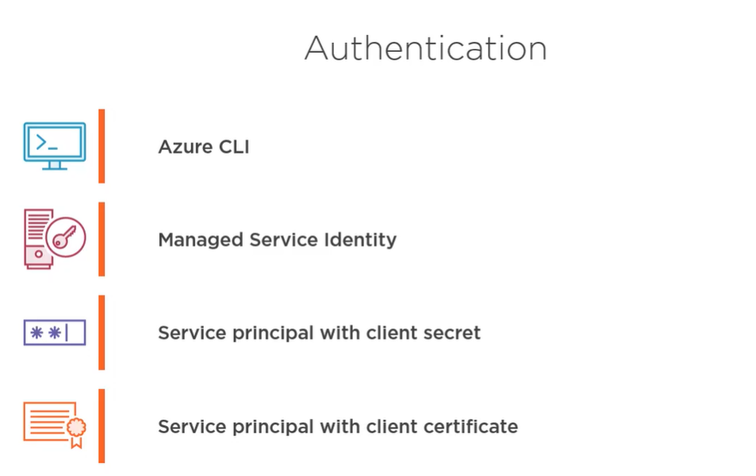

**We can authenticate the deployment in several ways by using the following methods.**

***Using Azure CLI***

This method is good when you are working in your local environment
```
Az login
Az account set --sub "****************"
```
***Using MSI (Managed Service Identity)***

Managed identities for Azure resources is a feature of Azure Active Directory (Azure AD). Using a managed identity for the Terraform host VM or container removes the need to pass a client secret or certificate to Terraform.

```
Provider "azurerm" {
	Version = "~> 0.32.0"
	Use_msi= "true"
	Subscription_id=""
	Tenant_id=""
}
```
***Using Service Principal ID and secret***

A Service Principal is an application within Azure Active Directory whose authentication tokens can be used as the client_id, client_secret, and tenant_id

* Create a new active directory application in azure portal
* Create a new client secret 
* Now, you need to assign the RBAC for the application in subscription scope or resource group scope level (as required)

```
Provider "azurerm" {
	Version = "~1.30.0"
	Subscription_id = ""
	Tenant_id=""
	Client_id=""
	Client_secret=""
}
```
***Using Service Principal ID and certificate***
https://www.terraform.io/docs/providers/azurerm/guides/service_principal_client_certificate.html

### Syntax Validate
* Terraform Validate can run pre-deployment checks for any syntax errors in the configuration before deployment.
* If the validation fails, a comment will be posted and showing the output of terraform validate with all syntax errors.
* It is recommended to run terraform validate before applying any changes.
	
```
Terraform validate 
```

### Terraform Build
***There are three steps to build infrastructure with Terraform:***
1. Initialize the Terraform configuration directory using terraform init
2. Create an execution plan using terraform plan
3. Create or modify infrastructure using terraform apply

#### Init
* Init is run in the configuration directory. 
* Init will create a hidden directory .terraform and download plugins as needed by the configuration.
* The terraform init command will automatically download and install any provider binaries required by the providers specified in the configuration. 
* If the initialization fails, a comment will be posted on the pull request showing the output of terraform init.

#### Plan
* Before you can create an infrastructure, Terraform needs to generate an execution plan. 
* The command to create or update the execution plan is terraform plan. 
* Terraform plan process starts with the refresh and inspect what is in the existing state file and it compares the existing state file with new desired state configuration file. 
```
terraform plan -out=path 
```
* The path to save the generated execution plan. 
* This plan can then be used with terraform apply to be certain that only the changes shown in this plan are applied. 
```
terraform apply "plan.tf"
```

#### Apply
* The terraform apply command is used to apply the changes in the configuration. 
* The output of the terraform apply shows the execution plan, and describing which actions the terraform will take in order to change the infrastructure to match the configuration.
```
Terraform apply
```

### Terraform state

* When Terraform created the infrastructure it also wrote data into the terraform.tfstate file. 
* The state keeps track of the all managed resources and their associated properties with current values. This state file is extremely important. 
* It is necessary to preserve the state file in a secured place for the entire life cycle of the resources.

***Remote state:***
Keeping state files of each environment in a remote location is must. Since the terraform apply modifying the infrastructure by comparing the state files. So, each of your environment has its own state file remote location. The remote location could be a source code repository or Azure storage account.. Etc.

* ***We can commit it to the code repository where you store all your terraform configuration files***
* ***But, this is not a recommended way to keep this file in code repository since it contains all the sensitive information of the infrastructure (include passwords)***
* ***The better way is to store it in Azure Storage container***
* If you change anything in the terraform configurations (like adding new resources), terraform builds an execution plan that only modifies what is necessary to reach your desired state.
* Terraform uses this state file to create plans and make changes to the infrastructure. 
* Before any terraform operation, Terraform does a refresh to update the state with the real infrastructure.
* The state file contains the below format and listed in JSON format.
* Every state has a monotonically increasing "serial" number. 
* ***If the destination state has a higher serial, Terraform will not allow you to write it since it means that changes have occurred since the state you're attempting to write***
* We can bypass this by passing the command `-force`
```
Version of the state file: "",
Terraform version: "",
Serial number: "",
Lineage: "",
Outputs: {},
Resources: []
```


#### Uses of storage account for state files:
* Azure Storage blobs are automatically locked before any operation that writes to state files. 
* This pattern prevents concurrent state operations, which can cause corruption. 

* Data stored in an Azure blob is encrypted before being persisted. 

#### What is terraform rule?
* Once you started the automation with terraform, make all the other changes of the infrastructure using terraform only
* Don't go manually and change the configuration of the resources.
* Sometimes it will break the deployment 


### Dependencies
When Terraform changes the infrastructure, many of the changes have to be made in a specific order. This order is determined by resource dependencies. There are two types of dependencies:

***Implicit dependencies,*** which Terraform and the Azure provider determine automatically for you based on the configuration. 

For example, you can't create a new virtual machine without first having a network interface (NIC). Azurerm "knows" to create the NIC before attempting to create the VM.

***Explicit dependencies,*** which you define using the depends_on meta-argument. Explicit dependencies are used when Terraform can't "see" an implicit dependency, and when you want to override the default execution plan.

### Variables
Terraform variables can be defined within the infrastructure plan but are recommended to be stored in their own variables file. All files in your Terraform directory using the .tf file format will be automatically loaded during operations.

Terraform supports a few different variable formats. Depending on the usage, the variables are generally divided into inputs and outputs.

#### Input Variables:
* The input variables are used to define values that configure your infrastructure. 
* These values can be used again and again without having to remember their every occurrence in the event. 
* It needs to be updated.
* The input variable usually defined by stating a name, type and value
* The type of the variable is not necessary. If you use it in the terraform 0.11 and later you will get a waring like below since terraform can deduct the type of the variable from the default or input value.
```
	variable "name" {
		type = "string"    
		default = "RG"
	  
	}
```

*** Terraform 0.11 and earlier required type constraints to be given in quotes, but that form is now deprecated and will be removed in a future version of Terraform.***

Again, the input variable divided into below parts

* Strings
* List
* Maps
* Bools

#### Output Variables
Output variables, in contrast, are used to get information about the infrastructure after deployment. These can be useful for passing on information such as IP addresses or DNS names for connecting to the server or to browse the DNS name.

Define a name for the output and what value it should represent. For example, you could have Terraform show your server’s IP address after deployment with the output variable below.
```
	output "Server-IP" {
	  value = "value"
	}
```

### What are the modules in terraform?
* With Terraform, you can put your code inside of a Terraform module and reuse that module in multiple places throughout your code. 
* Instead of having the same code copy/pasted in the staging and production environments, you’ll be able to have both environments reuse code from the same module.
* Modules are the key ingredient to writing reusable, maintainable, and testable Terraform code. 
* Once you start using them, there’s no going back. 

### What are the local values in terraform?
Local values can be helpful to avoid repeating the same values or expressions multiple times in a configuration, but if overused they can also make a configuration hard to read by future maintainers by hiding the actual values used.

Use local values only in moderation, in situations where a single value or result is used in many places and that value is likely to be changed in future. 

For example, in the below configuration I would like use the same naming convention for every resource. So I don't want to repeat same syntax multiple times. So we can simply add that configuration in local value and use it in multiple times wherever you want. 

```
# Regions Short Name using interpolation lookup syntax
variable "region" {
    default = {
      centralus = "centralus"
      eastus = "eastus"
      westus2 = "westus2"
  }
}
variable "shortname" {
    default = {
     centralus = "CUA01"
     eastus = "EUA01"
     westus2 = "WUA01"
    }
}


# Local Values
locals  {
 region_short_name = "${lookup (var.shortname, var.location, var.region)}"
}


# Resource Group (Used the local values for naming convention)
resource "azurerm_resource_group" "rg" {
  name = "${var.lobprefix}-${var.environment}-${local.region_short_name}-NET-RG"
  location = "${var.location}"
}

```

### Azure DevOps pipeline

* To create an azure DevOps pipeline for your multi infrstarcture environment deployment, go to DevOps organization, select the project and click on Releases
* Create a ***+New Release Pieline***, and start with an ***Empty Job***
* Select the artifact location, in this example our configuration files are located in GitHub, so select the GitHub as an artifact location for this pipeline
* Provide all the required details


**In the next step, we need to add some tasks to the agent job. A job is a series of steps that run sequentially as a unit. In other words, a job is the smallest unit of work that can be scheduled to run.**

The first task is, replace the terraform variables in our mainvar.tf file with pipeline variable, with this task we can avoid storing all the sensitive information in variable files.

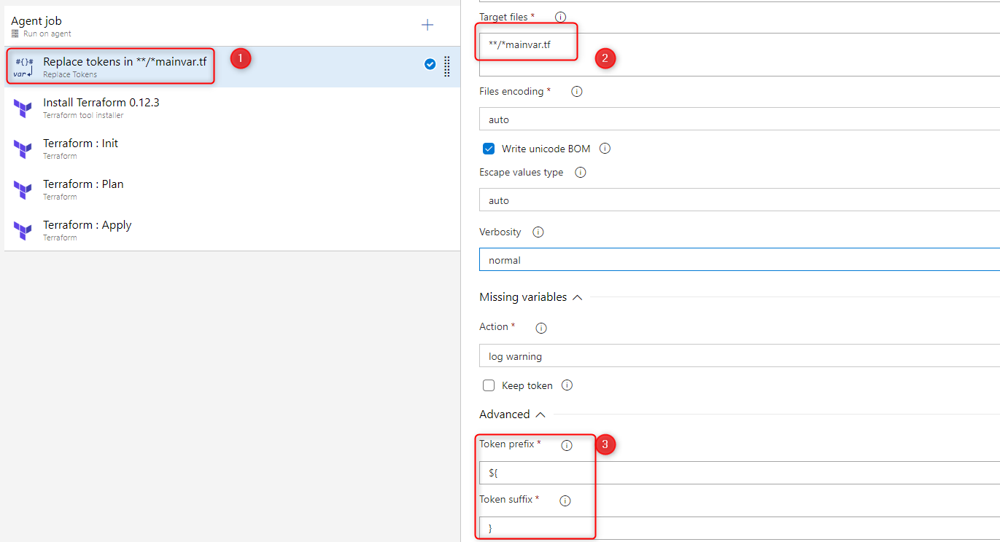

If you see the mainvar.tf file, you will notice that the values are suffixed with "${" and prefixed with "}"
The replace tokens task will replace the those values with the variable values defined in the release pipeline.


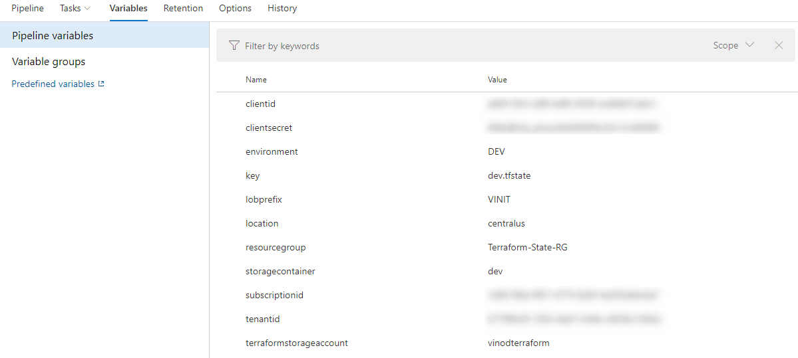

Second, the terraform installer task is used to install the terraform in the build agent. With this task we can specify the version of the terraform

Third, terraform init task. This task runs terraform init command. The terraform init command looks through all of the *.tf files in the current working directory and automatically downloads any of the providers required for them. 

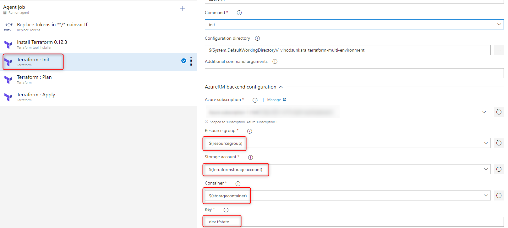

***Backend storage, the task is currently supporting two types of backend configurations***

1. local (default for terraform) - State is stored on the agent file system.
2. azurerm - State is stored in a blob container within a specified Azure Storage Account.
	
If you select the azurerm, it will ask for the storage account and container details. This task will automatically create the resource group, storage account, and container for remote azurerm backend, if not exists. To enable this, select the task for the terraform init command. Check the checkbox labled "Create Backend (If not exists)"

Fourth, terraform plan. The terraform plan command is used to create an execution plan. Terraform determines what actions are necessary to achieve the desired state specified in the configuration files. This is a dry run and shows which actions will be made. 

Fifth, terraform apply. The terraform apply command to deploy the resources. By default, it will also prompt for confirmation that you want to apply those changes. Since we are automating the deployment we are adding auto-approve argument to not prompt for confirmation.

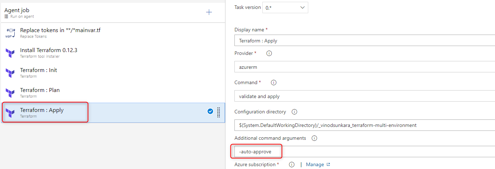


### Terraform Multi-Environment

Using Terraform, the production environment can be codified and then shared with staging, QA or dev. These configurations can be used to rapidly spin up new environments to test in, and then be easily disposed of. Terraform can help team the difficulty of maintaining parallel environments, and makes it practical to elastically create and destroy them.


Simply, replace the mainvvar.tf file variables with PROD environmebt pipeline variables, and store the tfstate file in another remote location

***OR we can create multi-environment pipelines using workspaces***

***Workspaces:***
Terraform workspaces are the successor to Terraform environments. workspaces allow you to separate your state and infrastructure without changing anything in your code. All workspace names would be supported by the tool and each workspace would be considered an environment.


### Output of the release pipeline
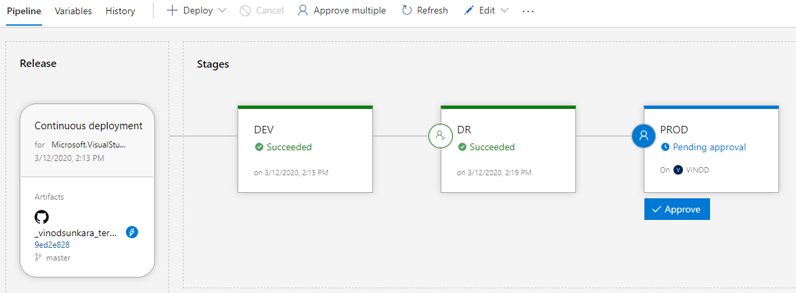
### Resource Groups of each environment 

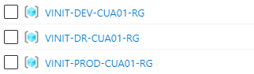

### Remote storage of state files

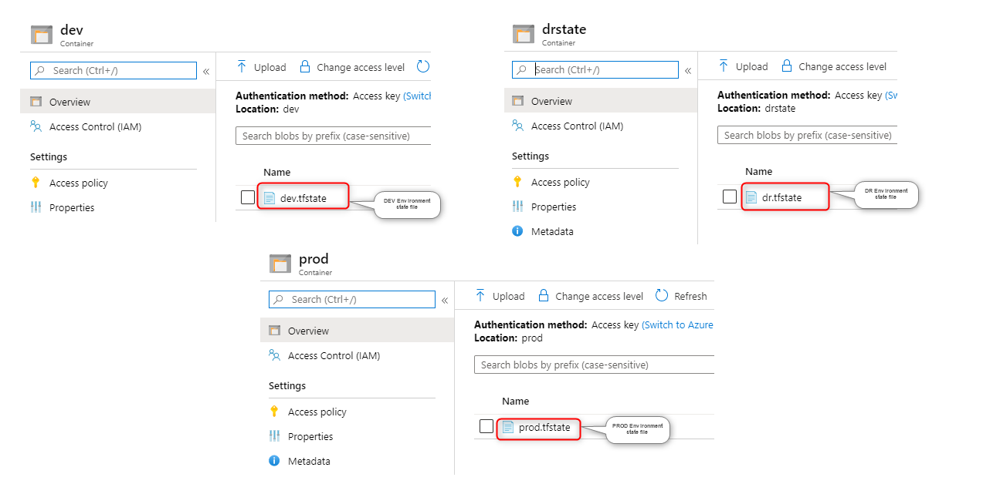