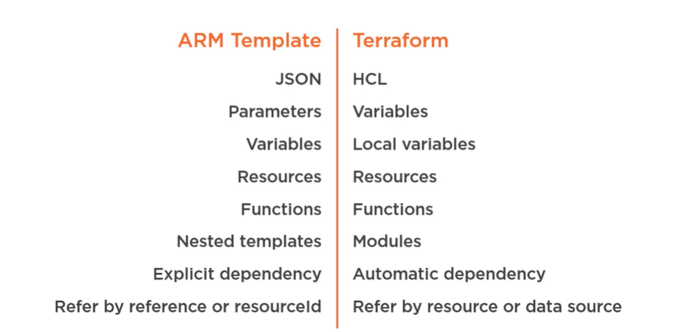

# Create a mutli-environment Infrastructure with Terraform and Azure DevOps

### Files

|File Name | Description |
|--------- | ------------|
| main.tf | It contains all the resource configurations |
| mainvar.tf | Replace with the pipeline variables |
| variables.tf | variables |
| provider.tf | Provider is basically to configure or provisioning resources in different cloud environments |


# Terraform 

## Introduction

### ARM vs Terraform


### Syntax


### Resources syntax (ARM vs HCL)


### Benifits of using Terraform for Azure
* Use terraform as you won't have to learn any tools since it is easy to write, and easy to understand. 
* The Terraform enables users to validate and preview infrastructure changes before application. 
* Deploys the same template multiple times to create identical development, test, and production environments.
* Unintended changes can be caught early in the development process

### Terraform state
* Terraform state is used to reconcile deployed resources with Terraform configurations. 
* State allows Terraform to know what Azure resources to add, update, or delete. 
* We can store these terraform state files in different locations (source repository, and storage accounts). 
* Storing state files in source repository along with the code is not recommended way since it contains all the sensitive information stored in a txt file. 
* The recommended way is using Azure storage account. 

### Uses of storage account for state files:
* Azure Storage blobs are automatically locked before any operation that writes to state files. 
* This pattern prevents concurrent state operations, which can cause corruption. 

* Data stored in an Azure blob is encrypted before being persisted. 
### Terraform Installation
Terraform is an open source flatform and just need to install the terraform package in target server if you want to start working.

**Installation:**
For windows, download the package from https://www.terraform.io/downloads.html and extract the file into any location. Now, set the terraform path in system advanced settings 

Open PC properties :arrow_forward: Advanced system settings :arrow_forward: Environment Variables :arrow_forward: Edit :arrow_forward: Paste the path

### Provider
Terraform provider can be defined within the infrastructure plan but are recommended to be stored in their own provider file. All files in your Terraform directory using the .tf file format will be automatically loaded during operations.


Provider is basically to configure or provisioning resources in different cloud environments. We can use the same configuration of terraform file in  multi-cloud environment by modifying the cloud provider name.

In this below block we are deploying the resources in azure

```
Provider "azurerm" {
	Version= "~>1.13.0"
}
```

The version is optional. It is used to constrain the provider to a specific version or a range of versions in order to prevent downloading a new provider that may possibly contain breaking changes. If the version isn't specified, Terraform will automatically download the most recent provider during initialization.

